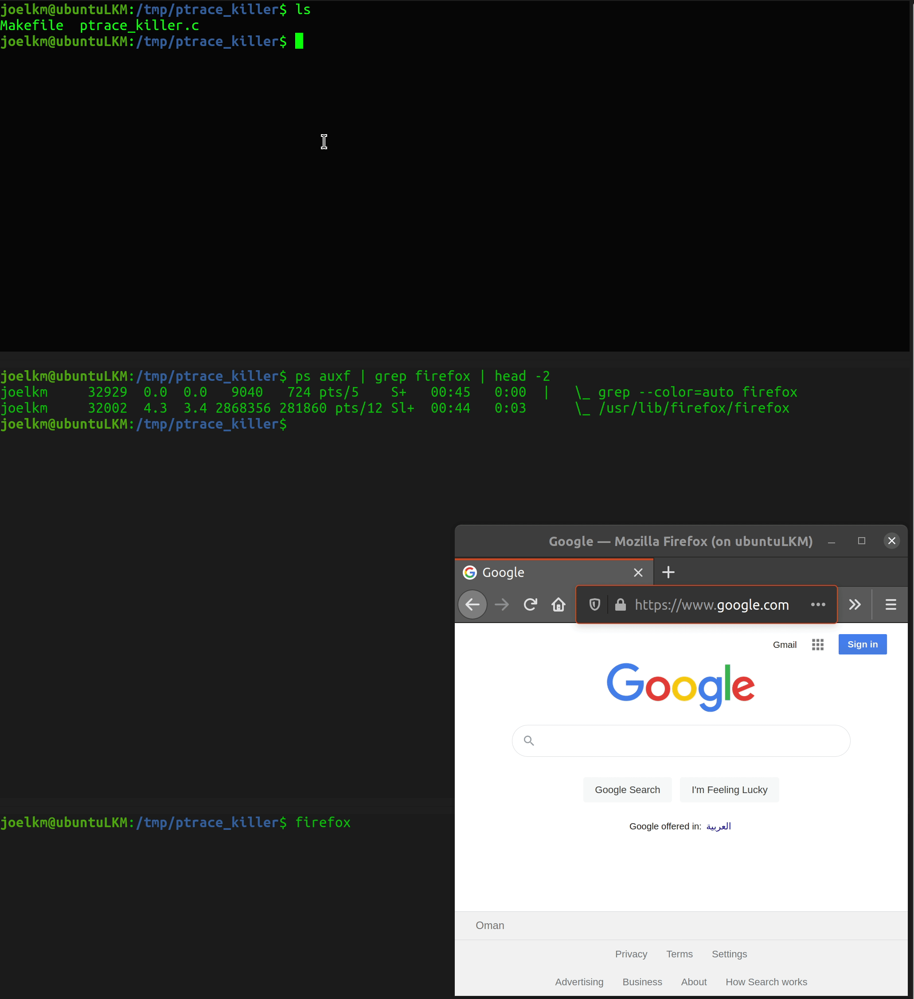

# ptrace_killer
A simple Linux LKM (Loadable Kernel Module) that detects any process that's utilizing ptrace and its tracees.

# Background: 
* This kernel module relies upon the Linux kernel `task_struct`'s `ptrace` [member](https://elixir.bootlin.com/linux/latest/source/include/linux/sched.h#L661) to detect whether a debugger is present or not.
* Once any process starts "ptracing" another, the [tracee](https://man7.org/linux/man-pages/man2/ptrace.2.html) gets added into [ptraced](https://elixir.bootlin.com/linux/latest/source/include/linux/sched.h#L867) that's located in `task_struct`, which is simply a linked list that contains all the tracees that the process is "ptracing".
* Once a tracer is found, the module lists all its tracees and sends a `SIGKILL` signal to each of them including the tracer. This results in killing both the tracer and its tracees.
* Once the module is attached to the kernel, the module's "core" function will run periodically through the advantage of workqueues. Specifically, the module runs every `JIFFIES_DELAY`, which is set to 1. That is, the module will run every one [jiffy](https://www.oreilly.com/library/view/linux-device-drivers/9781785280009/4041820a-bbe4-4502-8ef9-d1913e133332.xhtml). This can be changed through modifying the macro `JIFFIES_DELAY` defined in the module.
# Testing the module:
* First, you should make sure that GCC and kernel headers are already installed 
* debian-based distributions:
```
~$ sudo apt-get install build-essential linux-headers-$(uname -r)
```
* Clone the repo:
```
~$ git clone https://github.com/omr00t/ptrace_killer
```
* Compile the module:
```
~$ cd ptrace_killer && make
```
* If everything went all right, the module would be compiled into `.ko` file.
* The module can be loaded through:
```
~$ sudo insmod ptrace_killer.ko
```
* You can test the module through trying to debug a binary file with any debugger (gdb for example):
```
~$ gdb --pid=27931
GNU gdb (Ubuntu 9.1-0ubuntu1) 9.1
Copyright (C) 2020 Free Software Foundation, Inc.
License GPLv3+: GNU GPL version 3 or later <http://gnu.org/licenses/gpl.html>
This is free software: you are free to change and redistribute it.
There is NO WARRANTY, to the extent permitted by law.
Type "show copying" and "show warranty" for details.
This GDB was configured as "x86_64-linux-gnu".
Type "show configuration" for configuration details.
For bug reporting instructions, please see:
<http://www.gnu.org/software/gdb/bugs/>.
Find the GDB manual and other documentation resources online at:
    <http://www.gnu.org/software/gdb/documentation/>.

For help, type "help".
Type "apropos word" to search for commands related to "word".
Attaching to process 27931
Reading symbols from /tmp/test2...
(No debugging symbols found in /tmp/test2)
Killed
```
* As soon as gdb tried to "ptrace" the target process, gdb's got killed in addition to its tracee(s), of course.
* A gif showing the process:
* 
* Disable/Enable the module:
```
~$ echo -n "0" | sudo tee /sys/module/ptrace_killer/parameters/enabled  # Disable the module.
~$ echo -n "1" | sudo tee /sys/module/ptrace_killer/parameters/enabled  # Enable the module.
```
* Remove the module from the kernel entirely:
```
~$ sudo rmmod ptrace_killer
```
# Tested on Kernel v5.10.4
